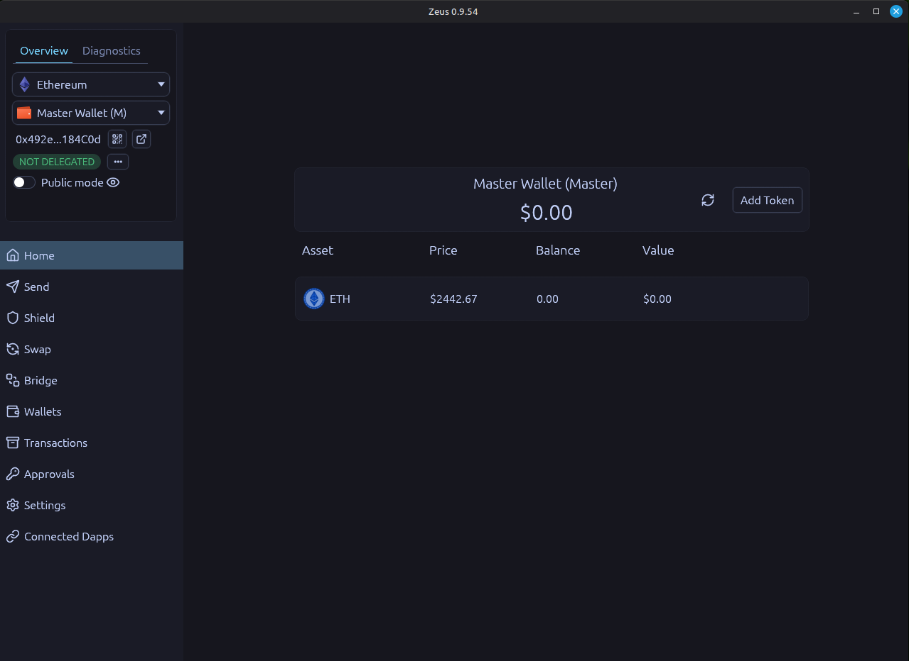

# <p align="center">Zeus</p>

## <p align="center"><b>A seedless, self-custodial Ethereum wallet that just works.</b></p>


 
 ---

 ### Zeus is also available on [radicle](https://radicle.network/nodes/rosa.radicle.network/rad%3AzNS8uWXgE8r87Zb8ito1wzg84gbc)
 ### RID: `rad:zNS8uWXgE8r87Zb8ito1wzg84gbc`
 
 
## Installation
**You may need to install [Rust](https://www.rust-lang.org/tools/install)**

1. Download the latest release from the [Releases](https://github.com/greekfetacheese/zeus/releases)
2. Zeus is portable, you just need to extract the folder and run the `zeus` executable.

**Zeus saves and loads its data from the current directory it exists, so if you want to move it move it with the entire folder**


## Supported Chains
- Ethereum Mainnet
- Optimism
- Arbitrum
- Base
- Binance Smart Chain

## Supported Platforms
- Windows
- Linux

## Minimum System Requirements
- RAM: 8GB (For wallet recovery)

---

## How Wallet management work in Zeus
Zeus is **seedless**, meaning that you don't need to have a seed phrase or a private key to access your wallet.

The first time you run Zeus you will be prompted to enter a **username** and a **password**. This will be used to derive your
master wallet **(Hierarchical Deterministic Wallet)** and you can generate as many wallets under it as you want.

You can also import an existing wallet by entering the mnemonic phrase or a private key, but these cannot be recovered
if you lose your vault.

It is very important that you don't forget your **username** and **password**, otherwise wallet recovery will be
impossible.

---

## How the wallet recovery works
Given that **username** and **password** a hash is generated using [Argon2Id](https://github.com/P-H-C/phc-winner-argon2) 
with the following parameters:
- **Salt:** SHA512 of the username
- **Memory cost:** 8192 MB
- **Iterations:** 96
- **Parallelism:** 1
- **Byte length:** 64 bytes

These parameters are constants and will not change in the near future.

Then a private key is derived based on the [BIP32](https://github.com/bitcoin/bips/blob/master/bip-0032.mediawiki) standard using the hash as the seed.
This private key then is used as your master wallet.

---

## How safe this recovery method is?
If we assume that the username and password have a decent entropy (at least 128bits 16+ characters) and the password is
not ever **exposed** in past breaches, it is practically impossible for someone to brute force your wallet. 

---

## Connecting to dapps
It is possible to connect Zeus to dapps through the [wallet-connector](https://github.com/greekfetacheese/zeus/tree/main/wallet-connector) extension, for chromium based browsers (Chrome, Brave etc.).

Currently the extension is not listed in the Chrome Web Store, so you will need to install it manually.

## Installing the extension
1. Download the wallet-connector.zip from the latest [release](https://github.com/greekfetacheese/zeus/releases)
2. You can use this [guide](https://bashvlas.com/blog/install-chrome-extension-in-developer-mode) on how to install the extension in developer mode.


## Features

| Feature | Details |
|--------|---------|
| **Wallet management** | Create HD wallets under one master, import/export wallets |
| **Send** | ETH and ERC-20 transfers |
| **Swaps** | Uniswap via the [Universal Router](https://docs.uniswap.org/contracts/v4/deployments) |
| **Cross-chain bridge** | Bridge ETH across supported chains with [Across](https://across.to/) (**BNB not supported**) |
| **Portfolio** | Simple public + private balance tracking |
| **Tx simulation** | Local EVM sims with [revm](https://github.com/bluealloy/revm) before you confirm what you see is what you get |
| **MEV protect** | MEV-vulnerable txs prefer mev-protect RPCs (**Ethereum mainnet only**) |
| **Dapp connect** | Via the [wallet-connector](https://github.com/greekfetacheese/zeus/tree/main/wallet-connector) extension, still WIP some dapps work, some don't |

### Railgun

Railgun is integrated in Zeus. Private balances shown in the UI are **ERC-20 only**.

| Operation | Assets | Notes |
|-----------|--------|--------|
| **Shield** | ERC-20 | Move public funds into the private pool |
| **Unshield** | ERC-20 | Default: private broadcaster (paymaster). Optional **self-broadcast** for emergency withdrawals (breaks anonymity). Optional unwrap WETH → ETH to fund new empty wallets |
| **Private transfer** | ERC-20 only | Send privately to a `0zk` address |
| **Merge notes** | ERC-20 only | Consolidate UTXO notes for an asset |

### RPC / data model

Zeus is built around the Ethereum RPC API. It does not depend on a third-party indexer or hosted backend, give it an RPC endpoint and it is ready to go.

Because of that it does **not** auto-index chain data (historical approvals, every token balance, etc.). It tracks what it has fetched and what you do in-app.

By default it uses free public RPCs from [Chainlist.org](https://chainlist.org/).
When you start Zeus for the first time **no RPC calls are made**, you can either enable any of the default RPCs or bring your own.

---


## Security
- **Strong encryption:** Zeus uses the [Argon2Id](https://github.com/P-H-C/phc-winner-argon2) as a KDF and [xChaCha20Poly1305](https://en.wikipedia.org/wiki/ChaCha20-Poly1305) as the encryption algorithm to derive the master wallet and encrypt the `Vault`.
- **No private key leaks:** Zeus uses [secure-types](https://github.com/greekfetacheese/secure-types) to handle private keys and other sensintive data in-memory. This makes it extremely hard for an attacker/malware to extract any private keys.
- **No telemetry:** Zeus does not need neither communicates with any third-party server, everything you do stays local on your computer.

## Bugs/Issues
I'm not aware of any major bugs, feel free to open an issue if you find any.

---


## Credits
Zeus wouldn't be possible without:
- [alloy-rs](https://github.com/alloy-rs/alloy)
- [revm](https://github.com/bluealloy/revm)
- [egui](https://github.com/emilk/egui)


## Build from source

For development:
```
cargo build --features dev
```

For release:
```
cargo build --profile prod
```