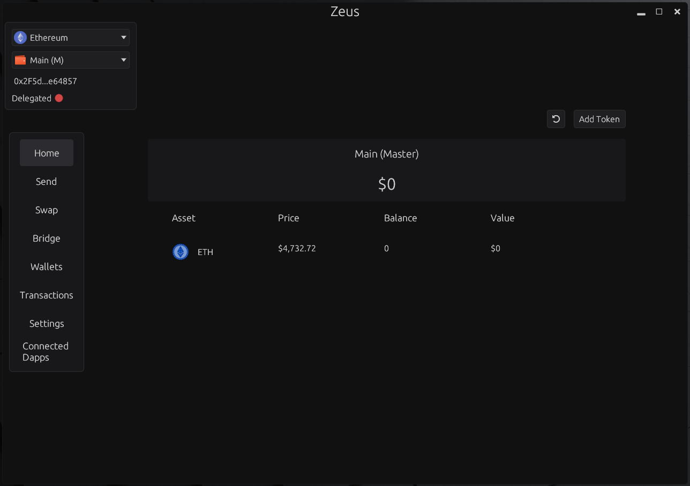

# <p align="center">Zeus</p>

## <p align="center"><b>An Ethereum Desktop Wallet with a focus on simplicity and security.</b></p>


 
 ---
 
 
## Installation
**Make sure you have [Rust](https://www.rust-lang.org/tools/install) installed.**

1. Download the latest release from the [Releases](https://github.com/greekfetacheese/zeus/releases)
2. Zeus is portable, you just need to extract the folder and run the `zeus-desktop` executable.

**Zeus saves and loads its data from the current directory it exists, so if you want to move it move it with the entire folder**

## Supported Chains
| Chain               | Status       |
|---------------------|--------------|
| Ethereum            | Supported    |
| Optimism            | Supported    |
| Binance Smart Chain | Partial      |
| Base Chain          | Supported    |
| Arbitrum            | Partial      |

## Supported Platforms
| Platform | Status       |
|----------|--------------|
| Windows  | Supported    |
| Linux    | Supported    |
| MacOS    | Coming Soon  |

---

## Features

### Zeus is still in heavy development, so as for now the features are limited to:
- **Wallet Management:** Import and manage your wallets.
- **Crypto Transactions:** Send ETH and ERC-20 tokens.
- **Cross-Chain Bridging:** Bridge ETH between the supported chains using [Across](https://across.to/) (**BNB is not supported**).
- **Basic Portfolio Tracking:** Monitor your assets with a simple interface.
- **Swap Tokens:** Swap tokens on the Uniswap protocol (through the [Universal Router](https://docs.uniswap.org/contracts/v4/deployments)). Still experimental, only works on Ethereum mainnet.
- **Transaction Simulation:** Zeus run local EVM simulations to verify transactions before you submit them.


 Currently Zeus does not use an indexer, it does not rely on any **Third-Party API** to index your wallet balances etc...
 
 That also means you need to manually add any tokens to each wallet if you want to see their balances.
 By default it uses free public rpc endpoints obtained from [Chainlist.org](https://chainlist.org/).
 
 You can of course bring your own endpoints and disable the default ones

---

## Security
> **Disclaimer** I'm not aware of any major bugs, but this is still work in progress and **not audited** so use at your own risk.

---

## Issues/Bugs

### Bridging Errors
While bridging and waiting for the transaction to complete Zeus may return an error while trying to see if the order has been filled at the destination chain, this is RPC related and there is not much i can do. Some free RPC's work great some don't. But since the deposit has been confirmed on the origin chain the order should go through normally.

### App Unresponsiveness
There are some rare cases where the app becomes unresponsive and finally need to shut it down manually, this is because at some point the main thread which runs the gui is blocked. Not really sure yet why or where is happening.

---

## Privacy
- **Zero telemetry**: Everything you do stays local on your computer.
 
 ---

## Roadmap
| Feature                          | Status          |
|----------------------------------|-----------------|
| Cloud backup (Google Drive, etc.)| Planned         |
| Full Uniswap integration         | Planned         |
| Cross-chain bridging             | Partial (No BNB)|
| dApp connectivity                | Planned         |

---

## Notes
Zeus is using [egui](https://github.com/emilk/egui) for its GUI.

While its smooth and fast without complex UI code some parts of the UI are misaligned, this is going to improve over time.

---

## Credits
Zeus wouldn't be possible without:
- [alloy-rs](https://github.com/alloy-rs/alloy)
- [revm](https://github.com/bluealloy/revm)
- [egui](https://github.com/emilk/egui)


## Build from source

For development:
```
cargo build --profile dev --features dev
```

For release:
```
cargo build --profile maxperf
```